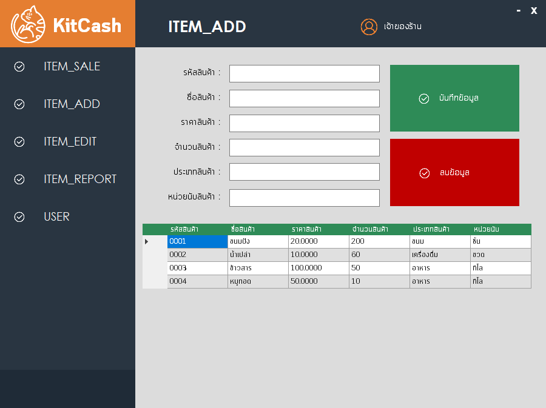

# KitCash

* This is a Project for computer programming 06016315
* โปรเจคนี้ เป็นส่วนหนึ่งของรายวิชา คอมพิวเตอร์โปรแกรมมิ่ง 06016315

### KitCash is a shop assitstant program which will help you manage your own shop. KitCash may help you organize storing goods, selling and billing with Line notify (send to line function will send a bill to your LINE ID), it's also able to chose date time with range to get a report(bill) too. so....
### KitCash เป็นโปรแกรม ที่จะคอยช่วยเหลือคุณในการจัดการร้านค้า. KitCash สามารถช่วยคุณจัดการสินค้าคงคลัง, การขายสินค้า และการรายงานผล ด้วย ฟังก์ชั่น send to line ผ่าน line notify จะสามารถส่งบิล ไปยังไลน์ของคุณได้ อีกทั้งยังสามารถ เลือกระยะเวลา ขอบเขต ที่ต้องการแสดงผลบิลได้อีกด้วย++ 
## PLEASE ENJOY

# Installation
[DOWNLOAD: (https://github.com/compro-itkmitl/KitCash)]
**Requirements**
* a computer/pc/laptop with windows 7/8/10 os
##MADE BY
* c++,c#,SQL
* Visual Studio 2017, Inno setup compiler
* Telek Reporting R2 2017
* Also use online/offline Database for storing data  
## ขั้นตอนการติดตั้ง
1. ทำการแตกไฟล์ ที่ทำการ download มาจาก github
2. เปิดโฟลเดอร์ Build-Only > Setup-File > *Setup.exe*
    - 
3. ดับเบิ้ลคลิก แล้วเริ่มทำการติดตั้ง เลือกตำแหน่งที่ต้องการติดตั้ง application แล้วเลือก *Next*
    - 
4. เลือก create icon on desktop เพื่อสร้างไอคอน บน Desktop แล้วเลือก *Next*
    - 
5. ทำการยืนยันตำแหน่งที่ต้องการติดตั้งแล้ว เลือก *Next*
    - 
6. ติดตั้งเสร็จสิ้น
    - 
# Using KitCash - การใช้งาน KitCash
### เนื่องจาก KitCash version ปัจจุบันใช้ฐานข้อมูลแบบ online จึงต้องทำการเชื่อมต่อกับ Internet ก่อนจึงจะใช้งานได้
### KitCash มี 4 ฟังก์ชั่นหลักๆคือ 
1. ITEM_SALE ฟังก์ชั่นการขายสินค้า
    - 
2. ITEM_ADD ฟังก์ชั่นการเพิ่มสินค้า
    - 
3. ITEM_EDIT ฟังก์ชั่นการแก้ไขสินค้า
    - 
4. ITEM_REPORT ฟังก์ชั่นการรายงานผล
    - 

1. เปิดโปรแกรม KitCash ขึ้นมา จะพบกับหน้าจอ Login ในที่นี้สามรถใช้ username: admin password: 1234 ได้เนื่องจากเป็น DEMO เมื่อทำการ login สำเร็จจะขึ้นหน้าต่างการแสดงผลว่า "สำเร็จ"
    - 
    - 
    - 
2. เมื่อทำการ login เสร็จสิ้นจะแสดงหน้าต่าง ฟังก์ชั่น ITEM_SALE สำหรับขายสินค้า
    - 
    - ฟังก์ชั่นการขายสินค้านั้นจะสามารถใช้ได้โดยการ
        1. กรอกรหัสสินค้า
        2. ใส่จำนวนที่ต้องการซื้อ
        3. กดเพิ่มสินค้า
        4. หากเลือกสินค้าจนเสร็จสิ้นแล้ว ให้กรอกรหัสลูกค้า และชื่อลูกค้า
        5. กดบันทึกการขาย เป็นอันเสร็จ
        *โดยใบเสร็จการซื้อขายซื้อขายจะถูกส่งไปยังฟังก์ชั่น Report*
3. หากต้องการ การรายงานผล ให้ไปยัง ฟังก์ชั่น ITEM_REPORT แล้วทำการเลือกวันที่ ที่ต้องการ การรายงานผล (หากเป็นวันเดียวกัน ให้วันตั้งต้นเป็นเมื่อวาน) แล้วกดแสดงผล และ แสดงยอด 
    - 
    - 
    - 
    - 
    - เมื่อทำการส่งเข้าไลน์ จะแสดงผลตามรูป
# Members
|  |ชื่อ|นามสกุล|GitHub Username|รหัสนักศึกษา|
|:-:|--|------|---------------|---------|
||Kitrawee|Phasukrojsin|[@nuengnakhap](https://github.com/sagelga)|60070005|
||Khosit|Khositsrikunakorn|[@kimkho](https://github.com/skydddoogg)|60070008|
||Chayanin|Lumyong|[@azurelisz](https://github.com/noppanut15)|60070012|
# Special Thanks
* Asst Profressor Kitsuchart Pasupa
    - 
* Asst Profressor Panwit Tuwanut
    - 
----------------------------------------
Thank you for Attentions

## Faculty of Information Technology 
## King Mongkut's Institute of Technology Ladkrabang
